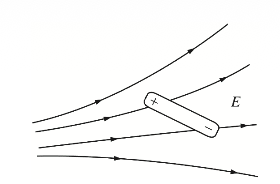
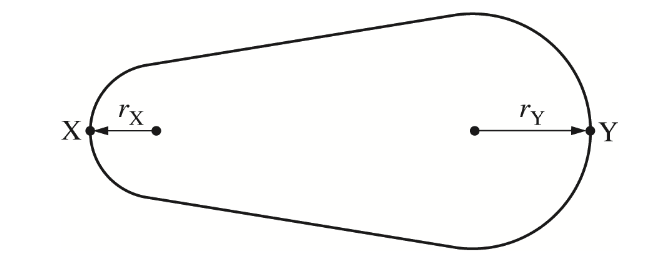
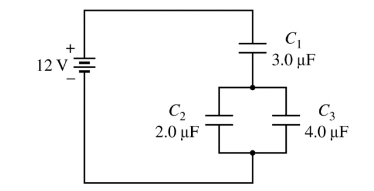

# Introduction
Recently I am preparing for a exam whcih referes to the AP E&M exam so I deceide to make such file to track my learnings.

## Learning route
I started with reading _Introduction to Electrodynamics_ by **David J. Griffith**, however, that is pretty tough to consider the real exact math work, so I decided to just understand the brief part and turn to problems directly.

# Problems and my Comprehensions

1. Two negative poit charges, both of magnitude $6.0 \times 10^{-6} C$, are situated along the x-axis at $x_1 = -2.0 m $ and $x_2 = + 2.0 m$, what is the electric potential at the origin?

>[!NOTE] Derivations
Easy to check that from Coloumb's Force, the net force at the origin them is 0, so initially, I naively think the potential is actually zero, with a little doubt. But actually, it's not.

>[!IMPORTANT] Definition of Electric Potential
$$V(r) = - \int _{O} ^{\mathbf{r}} \mathbf{E}\cdot d\mathbf{l} $$

Most of the time E vanishes at infinite, so define it from infinite point. By the curl-less-ness of E, we have the integral actually is releventless of the route it tracks.

So we can calculate in this way: 

$$V(\text{Origin}) = - \int_{\infty}^{\text{Origin}} \frac{kq}{r^2} dr = \frac{kq}{r} \mid_{\infty}^{2} = \frac{kq}{2} $$

And because the potential is a scalar, so direction doesn't matters final value shoule be $kq = 9 \times 10^{9} \times 6 \times 10 ^{-6} = 5.4 \times 10^{4} $

$k \approx 8.99 \times 10^9\text{ N}\cdot\text{m}^2/\text{C}^2$ (commonly rounded to $9.0 \times 10^9\text{ N}\cdot\text{m}^2/\text{C}^2$ for standard multiple-choice problems).

In a shallower version, we can just apply $V = \frac{kq}{r}$ which all of the variables are scalars.

2. An electric dipole consisting of a positive
charge and a negative charge held a fixed
distance apart is at rest in an external, nonuniform
electric field E, as shown in the figure above.
Which of the following best describes the net
torque and net force exerted on the dipole? **Check the direction of the net Torque and Net Force**.

>[!Note]
We need to check both poles in the dipole. At the positive pole, F is to right and at the negative pole, F is to left, so torque exists and clockwise. Because the positive pole is more "left", where we can heck that the density of the eletric field lines are more campact, so $F_{Positive} > F_{Negative} $, the net force is to left.

3. In the figure is a solid, isolated, metallic conductor in electrostatic
equilibrium with a net charge +Q. X and Y are at each end on the conductor.
Compare the Potential on X and Y.

>[!Warning] 
I used to think that equilibrium meansthat the density is uniform, so $Q_Y>Q_X$ then naturally $V_X>V_Y$.

That is absolutely **Wrong**.

>[!Note]
If $V_X\not=V_Y$, then electrons will move, until it is stable, so $V_X=V_Y$.

4. About capacitor
- Define Capacitance: $C=\dfrac{Q}{V}$.
    - However Cpacitance is defined by the quotient, but factors determined is on the properties of the capacitor itself.
    - For a standard parallel-plate capacitor, capacitance is determined by the formula:$$C = \frac{\varepsilon_0 A}{d}$$ Which $d$ is the distances, $A$ is the surface area.
    - The Material Factor (Dielectrics):$$C = \frac{\kappa \varepsilon_0 A}{d}$$, $\kappa$: dielectric constant
- Energy stored: $$U = \int_{0}^Q \frac{q}{C}dq = \frac{1}{2}\frac{Q^2}{C} =\frac{1}{2}QV $$
- in one circuit:

From the rule of how capacitors store charges.
When it has already reached steady state, we can derive that $Q_{C_1}=Q_{C_{2,3equally}}$ and when we consider 2,3, $V_{C_2}=V_{C_3} $, so ${C_{2,3}}={C_2}+{C_3}$

5. A long, straight wire of radius R carries current I.
The current is distributed over the cross-sectional
area of the wire with a uniform current density.
Which of the following graphs best represents the
magnetic field strength produced by the current as
a function of the distance r from the center of the
wire?

>[!Note] Ampere's Law
$$\nabla\times \mathbf{B} = \mu_0\mathbf{J} $$
$$\oint{\mathbf{B}\cdot d\mathbf{l}}= \mu_0I_{enc}$$

So actually, when $r<R$ at a certain point inside a cylindral, we just need to consider the cycle contains it, it is like from cylindral to a circle pancake to a circle linear which radii $r$.

we have $B(2\pi r)= \mu_0I\cdot\frac{r^2}{R^2} $ then $\mathbf{B}$ is proportional to radius $r$.

Especially, point outside of a line current, we can see it as $B(2\pi r) = \mu_0 I \Rightarrow B = \frac{\mu_0I}{2\pi} $

